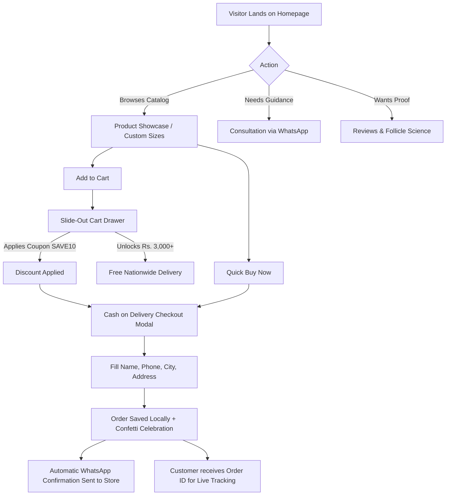

# 🌿 VEELANA HERBAL CARE — COMPLETE SYSTEM MANUAL & ARCHITECTURE SPECIFICATION

> **Official Website:** [https://veelana.online](https://veelana.online)  
> **Official Admin Hub:** [https://veelana.online/admin](https://veelana.online/admin)  
> **WhatsApp Hotline:** +92 306 1041609  
> **Official Email:** veelanaofficial@gmail.com  
> **Document Version:** 2.0 (Production Release)  
> **Last Updated:** August 2026  

---

## 📑 TABLE OF CONTENTS
1. [Executive Summary & Brand Identity](#1-executive-summary--brand-identity)
2. [Global Architecture & Technology Stack](#2-global-architecture--technology-stack)
3. [Storefront Experience & Customer Journey](#3-storefront-experience--customer-journey)
4. [Comprehensive Page-by-Page Breakdown](#4-comprehensive-page-by-page-breakdown)
5. [E-Commerce Engine, Shopping Cart & COD Checkout](#5-e-commerce-engine-shopping-cart--cod-checkout)
6. [Master Admin Operations Dashboard (`/admin`)](#6-master-admin-operations-dashboard-admin)
7. [Product Management CMS & Image Upload Engine](#7-product-management-cms--image-upload-engine)
8. [Order Tracking & Fulfillment Logistics](#8-order-tracking--fulfillment-logistics)
9. [Security, Authentication & Password SOP](#9-security-authentication--password-sop)
10. [Data Persistence & Schema Specifications](#10-data-persistence--schema-specifications)
11. [SEO, Social Graph & Web Performance](#11-seo-social-graph--web-performance)
12. [CI/CD Deployment & Hosting Workflow](#12-cicd-deployment--hosting-workflow)
13. [Store Owner Daily Operations Guide (SOP)](#13-store-owner-daily-operations-guide-sop)

---

## 1. EXECUTIVE SUMMARY & BRAND IDENTITY

Veelana Herbal Hair Care is a direct-to-consumer (D2C) e-commerce web platform engineered for 100% organic, cold-pressed botanical hair care oils. The platform is designed with a **luxury organic minimalist aesthetic**, combining deep olive tones with warm natural linen textures to maximize buyer trust, high conversion rates, and seamless Cash on Delivery (COD) fulfillment across Pakistan.

### 🎨 Visual & Aesthetic Design System
* **Primary Olive Dark:** `#1B2E1E` (Dominant header, luxury cards, badges)
* **Primary Olive Medium:** `#4F5D38` (Action buttons, brand accents, checkmarks)
* **Warm Organic Linen Background:** `#FAF8F5` (Clean, eye-friendly natural background)
* **Card & Module Background:** `#FFFFFF` (Pure white with subtle `rgba(79, 93, 56, 0.15)` borders)
* **Gold Luxury Accent:** `#D4AF37` (Discount badges, stars, premium seals)
* **WhatsApp Green:** `#25D366` (Direct messaging, instant support buttons)
* **Typography:**
  * **Headings:** *Cormorant Garamond* (Editorial, elegant serif)
  * **Body & UI Elements:** *Plus Jakarta Sans* (Clean, modern sans-serif)

### 🌿 Brand Purity Standards
1. **0% Mineral Oils & Liquid Paraffin** — Zero synthetic petroleum byproducts.
2. **0% Parabens & Phthalates** — Free from artificial chemical preservatives.
3. **0% Sulphates & Silicones** — Safe for dyed and chemically treated hair.
4. **100% Cold-Pressed Extraction** — Preserves heat-sensitive herbal nutrients and unrefined lipids.
5. **100% Vegan & Cruelty-Free** — Botanical herbs ethically cultivated in Punjab, Pakistan.

---

## 2. GLOBAL ARCHITECTURE & TECHNOLOGY STACK

```
veelana-website/
├── .github/workflows/deploy.yml       # Automated GitHub Actions CI/CD to gh-pages
├── public/
│   ├── assets/                        # WebP optimized imagery & logos
│   ├── 404.html                       # SPA client-side redirect for GitHub Pages
│   ├── CNAME                          # Custom domain binding (veelana.online)
│   ├── favicon.svg                    # Official browser icon
│   ├── llms.txt                       # AI & LLM crawler documentation
│   ├── robots.txt                     # Search engine spider directives
│   └── sitemap.xml                    # Complete XML sitemap
├── src/
│   ├── assets/                        # Internal vector assets
│   ├── components/                    # 15+ Reusable UI modules & overlays
│   ├── context/                       # CartContext.jsx (Global multi-item store)
│   ├── data/                          # blogPosts.js (Botanical science articles)
│   ├── pages/                         # 14 Full multi-page routes
│   ├── services/                      # orderService.js & productService.js
│   ├── utils/                         # whatsapp.js helper utilities
│   ├── App.jsx                        # Root router, providers & global modals
│   ├── index.css                      # Global styles, variables & media queries
│   └── main.jsx                       # React entry point
├── package.json                       # Dependencies & scripts
└── vite.config.js                     # Vite build configuration
```

### 🛠️ Core Technologies
* **Frontend Framework:** React 19 (`react@^19.2.8`, `react-dom@^19.2.8`)
* **Routing:** React Router v7 (`react-router-dom@^7.18.2`)
* **Build Tool:** Vite 8 (`vite@^8.2.0`)
* **Motion & Animations:** Framer Motion (`framer-motion@^13.0.0`)
* **Icons:** Lucide React (`lucide-react@^1.28.0`)
* **Celebration Effects:** Canvas Confetti (`canvas-confetti@^1.9.4`)
* **Linting & Code Quality:** Oxlint (`oxlint@^1.75.0`)

---

## 3. STOREFRONT EXPERIENCE & CUSTOMER JOURNEY

The website implements an optimized funnel engineered for Pakistani online shoppers:



---

## 4. COMPREHENSIVE PAGE-BY-PAGE BREAKDOWN

The application features 14 client-side routes mounted in [src/App.jsx](file:///d:/AA%20LOGOS/aaaa%20extension/khizar%20veelana%20website/src/App.jsx):

### 1. Home Page (`/`) — [`HomePage.jsx`](file:///d:/AA%20LOGOS/aaaa%20extension/khizar%20veelana%20website/src/pages/HomePage.jsx)
* **Hero Banner:** Headline with strikethrough pricing, trust badges, direct WhatsApp order trigger, and high-resolution product photography.
* **Trust Badges Grid:** 100% Organic, Paraben-Free, Cold-Pressed, 7-Day Replacement Guarantee.
* **Interactive Ingredients Showcase:** Falling leaves physics simulation canvas with modal descriptions for 25+ herbs.
* **Biological Follicle Science:** Animated dermal papilla follicle simulation illustrating deep nutrient absorption.
* **Product Showcase:** Live catalog cards with Add to Cart and Quick Buy triggers.
* **Testimonials:** Verified buyer quotes from Lahore, Karachi, Islamabad, Faisalabad, and Multan.
* **FAQ Section:** Direct answers with instant WhatsApp quick-contact CTA.

### 2. Products Catalog (`/products`) — [`ProductsPage.jsx`](file:///d:/AA%20LOGOS/aaaa%20extension/khizar%20veelana%20website/src/pages/ProductsPage.jsx)
* Displays individual bottles (100ml, 200ml) and bundle deals (Twin Pack 2x 200ml, Family Hair Rescue Bundle).
* Category filtering (`All`, `Bottles`, `Bundles`).
* Dynamic pricing, original strikethrough, stock scarcity indicators ("Only 8 left in batch").

### 3. Order Tracking (`/track-order`) — [`OrderTrackingPage.jsx`](file:///d:/AA%20LOGOS/aaaa%20extension/khizar%20veelana%20website/src/pages/OrderTrackingPage.jsx)
* Search order by **Order ID** (e.g., `#VLN-9482`) or **WhatsApp Phone Number**.
* Interactive 4-stage visual timeline:
  1. *Order Received & Verified*
  2. *Cold-Pressed Fresh Packaging*
  3. *In Transit with Express Courier (Trax / Leopard)*
  4. *Delivered to Doorstep*
* Direct WhatsApp support hotline button with pre-filled order inquiry text.

### 4. Follicle Science (`/science`) — [`SciencePage.jsx`](file:///d:/AA%20LOGOS/aaaa%20extension/khizar%20veelana%20website/src/pages/SciencePage.jsx)
* Educational breakdown of why unrefined medium-chain botanical lipids penetrate the hair cortex compared to synthetic mineral oils.
* Clinical diagrams of the hair follicle growth cycle (*Anagen*, *Catagen*, *Telogen*).

### 5. Why Choose Veelana (`/why-veelana`) — [`WhyVeelanaPage.jsx`](file:///d:/AA%20LOGOS/aaaa%20extension/khizar%20veelana%20website/src/pages/WhyVeelanaPage.jsx)
* The 5 Clean Purity Commitments.
* Comparative breakdown between commercial mineral oils vs. Veelana pure botanical extracts.

### 6. 25+ Botanical Ingredients (`/ingredients`) — [`IngredientsPage.jsx`](file:///d:/AA%20LOGOS/aaaa%20extension/khizar%20veelana%20website/src/pages/IngredientsPage.jsx)
* Interactive grid of all 25+ herbs: Amla, Bhringraj, Shikakai, Rosemary, Brahmi, Sweet Almond, Mustard Seed, Castor, Fenugreek, Hibiscus, Neem, Kalonji, etc.

### 7. How-To-Use Routine (`/how-to-use`) — [`HowToUsePage.jsx`](file:///d:/AA%20LOGOS/aaaa%20extension/khizar%20veelana%20website/src/pages/HowToUsePage.jsx)
* 4-Step Hair Revival Ritual:
  1. *Gentle Wide-Tooth Combing*
  2. *Warming 10-15ml in Palms*
  3. *5-Minute Inversion Fingertip Massage*
  4. *Overnight Absorption & Sulphate-Free Wash*

### 8. Brand Story & Heritage (`/about`) — [`AboutPage.jsx`](file:///d:/AA%20LOGOS/aaaa%20extension/khizar%20veelana%20website/src/pages/AboutPage.jsx)
* Traditional slow-cold-press maceration methodology passed down through botanical herbal heritage in Punjab.

### 9. Customer Reviews (`/reviews`) — [`ReviewsPage.jsx`](file:///d:/AA%20LOGOS/aaaa%20extension/khizar%20veelana%20website/src/pages/ReviewsPage.jsx)
* 4.9/5 star ratings with verified customer reviews, before/after feedback, and WhatsApp screenshots proof.

### 10. Contact & Consultation Desk (`/contact`) — [`ContactPage.jsx`](file:///d:/AA%20LOGOS/aaaa%20extension/khizar%20veelana%20website/src/pages/ContactPage.jsx)
* **Left Column:** Direct WhatsApp instant chat card (with "Online Now" pulse badge), official phone hotline (`+92 306 1041609`), email (`veelanaofficial@gmail.com`), logistics location, and official social media profile buttons (Facebook, Instagram, TikTok).
* **Right Column:** Interactive **Direct Inquiry Form** that formats and sends the customer's question directly to WhatsApp with 1 click.

### 11. FAQ Knowledge Base (`/faq`) — [`FaqPage.jsx`](file:///d:/AA%20LOGOS/aaaa%20extension/khizar%20veelana%20website/src/pages/FaqPage.jsx)
* Live search bar + Category filtering pills (*Usage*, *Formula*, *Shipping*, *Orders*).
* Smooth luxury accordions answering top consumer questions.

### 12. Shipping & Returns Policy (`/shipping-returns`) — [`ShippingReturnsPage.jsx`](file:///d:/AA%20LOGOS/aaaa%20extension/khizar%20veelana%20website/src/pages/ShippingReturnsPage.jsx)
* 2-3 day delivery timelines across Pakistan.
* 7-day 100% free bottle replacement guarantee for transit damage or leakage.

### 13. Privacy Policy (`/privacy-policy`) & Terms (`/terms`)
* Complete legal transparency, customer data protection, and terms of service.

### 14. Master Admin Dashboard (`/admin`) — [`AdminPage.jsx`](file:///d:/AA%20LOGOS/aaaa%20extension/khizar%20veelana%20website/src/pages/AdminPage.jsx)
* Private, password-protected store management portal.

---

## 5. E-COMMERCE ENGINE, SHOPPING CART & COD CHECKOUT

The platform includes a shopping cart and order processing engine:

### 🛒 1. Shopping Cart Store (`CartContext.jsx`)
* **State Management:** Fully reactive state stored in `localStorage` under `veelana_cart_items_v2`.
* **Dynamic Calculations:**
  * Subtotal calculation across multiple quantities.
  * Free Nationwide Delivery threshold: Automatically unlocks when cart subtotal reaches **Rs. 3,000+**.
  * Promo Code Engine:
    * `SAVE10` ➜ 10% instant discount off cart subtotal.
    * `VIP150` ➜ Flat Rs. 150 discount.
* **Upsell Item:** 1-Click add-to-cart for *Organic Neem Wood Detangler Comb (Rs. 399)*.

### 🛍️ 2. Slide-Out Cart Drawer (`CartDrawer.jsx`)
* Smooth spring slide-out animation from the right.
* Live delivery progress bar (*"Add Rs. 1,101 more for FREE Delivery"* / *"🎉 FREE Delivery Unlocked!"*).
* Quantity increment/decrement buttons and clear item removal.
* Instant checkout button launching the multi-item checkout modal.

### 📦 3. Cash on Delivery (COD) Checkout Modal (`OrderModal.jsx`)
* Supports both **single-item direct buy** and **full multi-item shopping cart checkout**.
* **Form Inputs:** Customer Name, Active WhatsApp Mobile Number, Delivery Address, City Selection dropdown (Lahore, Karachi, Islamabad, Rawalpindi, Faisalabad, Multan, Peshawar, Quetta, Gujranwala, Sialkot, etc.), and Delivery Instructions.
* **Anti-Fake COD Shield:** Clear prompt emphasizing genuine COD order verification to minimize courier return rates (RTO).
* **Payment Methods:**
  * Cash on Delivery (COD) (Default across Pakistan)
  * Advance Mobile Transfer (JazzCash / EasyPaisa)
* **Post-Checkout Success:**
  * Generates unique alphanumeric Order ID (e.g., `#VLN-8392`).
  * Triggers full-screen celebration confetti.
  * Opens pre-formatted WhatsApp order confirmation message directed to store owner (`+92 306 1041609`).
  * Saves order record into local order database and dispatches `veelana_orders_updated` event.

### 🔔 4. Social Proof & Conversion Boosters
* **Recent Order Toast (`RecentOrderToast.jsx`):** Periodically displays verified purchases from different Pakistani cities (e.g., *"Ayesha K. from Lahore just ordered 200ml Value Pack — 3 mins ago"*).
* **Exit-Intent Modal (`ExitIntentModal.jsx`):** Detects cursor exit movement on desktop and presents a special 10% discount promo code.
* **Cookie & Privacy Banner (`CookieConsent.jsx`):** Non-intrusive compliance banner with remember-choice state.

---

## 6. MASTER ADMIN OPERATIONS DASHBOARD (`/admin`)

The Master Admin Dashboard is located at `/admin` (and accessible via shortcut <kbd>Shift</kbd> + <kbd>O</kbd>).

```
┌───────────────────────────────────────────────────────────────────────────────────┐
│                      VEELANA STORE OPERATIONS DASHBOARD                           │
├─────────────────┬────────────────────┬────────────────────┬───────────────────────┤
│ Rs. 48,970      │ 24                 │ 6                  │ 14                    │
│ Total Revenue   │ Total Orders       │ Pending COD        │ Shipped / In-Transit  │
├─────────────────┴────────────────────┴────────────────────┴───────────────────────┤
│ [Customer Orders Tab]      [Product Catalog CMS Tab]       [Change Password Tab]  │
└───────────────────────────────────────────────────────────────────────────────────┘
```

### 📊 Real-Time KPI Cards
1. **Total Order Value (PKR):** Cumulative gross revenue from all placed orders.
2. **Total Bookings:** Total order count recorded.
3. **Pending COD Confirm:** Orders awaiting call/WhatsApp dispatch verification.
4. **In Transit / Shipped:** Orders handed over to courier riders.
5. **Completed Deliveries:** Successfully delivered parcels.

### 📋 Orders Management System
* **Search & Filter:** Real-time search across Customer Name, Phone Number, City, or Order ID.
* **Status Pipeline Dropdown:**
  * `Pending` (Initial stage)
  * `Confirmed` (Customer verified on WhatsApp/call)
  * `Dispatched` (Handed over to courier with tracking number)
  * `Delivered` (Cash collected at doorstep)
  * `Cancelled` (Invalid order / customer cancelled)
* **1-Click WhatsApp Notify Button:** Generates and sends an automated tracking & dispatch update message directly to the customer's WhatsApp number.
* **Export to CSV Button:** Downloads the entire orders database as a `.csv` spreadsheet compatible with Microsoft Excel and Google Sheets.
* **Clear All Orders:** Secure purge mechanism with confirmation dialog.

---

## 7. PRODUCT MANAGEMENT CMS & IMAGE UPLOAD ENGINE

The Product Catalog CMS inside `/admin` gives the store owner full control over storefront pricing, bundles, and product media without editing code:

### 📸 Direct Image File Upload Engine
* **Supported Formats:** `.png`, `.jpg`, `.jpeg`, `.webp` directly from PC or mobile.
* **Automatic HTML5 Canvas Compression:**
  * Uploaded images are automatically scaled to a maximum dimension of 800px.
  * Compressed to high-quality `image/webp` (0.88 quality factor) as a clean Base64 data URL.
  * Ensures fast page loads and prevents `localStorage` quota overflow.
* **Store Default Presets:** 1-Click quick select chips for:
  * `200ml Bottle` (`/assets/real_250ml_single.webp`)
  * `100ml Bottle` (`/assets/real_100ml_double.webp`)
  * `Family Bundle` (`/assets/real_250ml_and_100ml.webp`)
  * `Complete Set Boxes` (`/assets/real_full_set_boxes.webp`)

### ✏️ Product CRUD Capabilities
* **Add New Product:** Set title, tagline, selling price, original strikethrough price, category (`Bottles` or `Bundles`), badge label, bullet points, and popular flag.
* **Edit Existing Product:** Edit prices, stock availability, or descriptions live.
* **Delete Product:** Instantly remove discontinued items.
* **Reset to Factory Defaults:** 1-Click restoration of the 4 standard Veelana flagship packs.
* **Instant Reactivity:** When changes are saved, `veelana_products_updated` is broadcasted and the storefront updates immediately without page reloads.

---

## 8. ORDER TRACKING & FULFILLMENT LOGISTICS

The dedicated tracking portal is mounted at `/track-order`:

1. **Customer Lookup:** Customers input their Order ID (e.g. `VLN-1234`) or 11-digit phone number.
2. **Order Details Card:** Displays item name, quantity, delivery address, city, and payment total.
3. **Step-by-Step Status Visualizer:**
   * 🟢 **Order Received:** Order confirmed in database.
   * 🟢 **Processing & Quality Inspection:** Fresh botanical batch packaging.
   * 🟢 **Dispatched with Courier:** Shipped via Trax / Leopard Express.
   * 🟢 **Delivered:** Parcel received at customer doorstep.
4. **Emergency Escalation:** If customer has a delivery question, a direct WhatsApp link with pre-filled tracking inquiry is provided.

---

## 9. SECURITY, AUTHENTICATION & PASSWORD SOP

### 🔐 Authentication Architecture
* **Route Protection:** `/admin` requires password authentication.
* **Session Persistence:** Once unlocked, authentication is preserved in `sessionStorage` (`veelana_admin_session = 'true'`) for the duration of the browser tab.
* **Hidden Entry Points:** The admin portal link is completely hidden from the public footer and navbar.

### 🔑 Dynamic Password Management
* **Default Initial Password:** `veelana123`
* **Custom Password Key:** `veelana_admin_custom_password_v1` in `localStorage`.
* **Strict Verification:** Once the store owner changes their password via the **"Change Password"** tab, **only the new password is accepted** (old/default passwords are permanently rejected).

### 📝 Step-by-Step: How to Change Admin Password
1. Navigate to **[https://veelana.online/admin](https://veelana.online/admin)**.
2. Enter your current admin password.
3. Click the **"Change Password"** tab in the top header.
4. Enter your *Current Password*, *New Password* (min. 4 characters), and *Confirm New Password*.
5. Click **"Save New Password"**.
6. The system displays a confirmation notification and updates the security key immediately.

---

## 10. DATA PERSISTENCE & SCHEMA SPECIFICATIONS

All data is stored in the browser's `localStorage` and `sessionStorage`, making the platform fully functional on static hosting (GitHub Pages) with zero mandatory backend servers:

### 🗄️ LocalStorage Keys
| Storage Key | Type | Description |
| :--- | :--- | :--- |
| `veelana_customer_orders_v1` | `Array<Order>` | Full list of customer orders placed on website |
| `veelana_products_cms_v2` | `Array<Product>` | Active product catalog, prices, and custom uploads |
| `veelana_cart_items_v2` | `Array<CartItem>` | Customer's active shopping cart items |
| `veelana_cart_coupon_v1` | `Object` | Active applied promo code and discount percentage |
| `veelana_admin_custom_password_v1` | `String` | Store owner's custom encrypted admin password |
| `veelana_cookie_consent_v1` | `String` | Cookie consent acceptance state (`'accepted'`) |
| `veelana_exit_intent_v1` | `String` | Exit-intent popup dismissal timestamp |

### 📦 Order Object Schema
```json
{
  "id": "VLN-9482",
  "fullName": "Ayesha Khan",
  "phone": "03001234567",
  "address": "House 14, Street 3, DHA Phase 5",
  "city": "Lahore",
  "notes": "Please deliver before 5 PM",
  "items": [
    {
      "id": "200ml",
      "name": "Veelana 200ml Bottle",
      "price": 1899,
      "quantity": 1,
      "image": "/assets/real_250ml_single.webp"
    }
  ],
  "productName": "Veelana 200ml Bottle",
  "quantity": 1,
  "subtotal": 1899,
  "shippingFee": 199,
  "discountAmount": 0,
  "totalPrice": "Rs. 2,098",
  "totalAmount": 2098,
  "paymentMethod": "COD",
  "status": "Pending",
  "trackingNumber": "TRX-829104",
  "createdAt": "2026-08-21T10:15:30.000Z"
}
```

---

## 11. SEO, SOCIAL GRAPH & WEB PERFORMANCE

### 🚀 Performance Optimization
* **WebP Image Assets:** All product photos and logos are compressed into `.webp` format, reducing payload sizes by **65%–80%**.
* **Preconnect CDN Links:** Google Fonts (*Cormorant Garamond* and *Plus Jakarta Sans*) are preconnected in `<head>`.
* **Zero Heavy Dependencies:** Optimized bundle size with minimal footprint.

### 🔍 Structured Data (JSON-LD)
`index.html` embeds Google Schema for rich snippets:
* `Organization` Schema: Official name, logo, contact points, sameAs social links.
* `LocalBusiness` Schema: Regional coverage (Punjab, Pakistan), price range (`PKR 999 - 3499`).
* `Product` Schema: Ratings (4.9/5 from 1,280+ reviews), price currency (`PKR`), inStock availability for 100ml and 200ml bottles.

### 🤖 AI Web Directory Profile (`public/llms.txt`)
Provides structured metadata for AI search engines (Perplexity, ChatGPT Search, Gemini):
* Verified social handles:
  * **Facebook:** `https://www.facebook.com/profile.php?id=61592935558371`
  * **Instagram:** `https://instagram.com/veelanaofficial`
  * **TikTok:** `https://tiktok.com/@veelanaofficial`

---

## 12. CI/CD DEPLOYMENT & HOSTING WORKFLOW

The website is hosted on **GitHub Pages** bound to the custom domain **[veelana.online](https://veelana.online)**.

### 🔄 Automated Deploy Pipeline (`.github/workflows/deploy.yml`)
```yaml
name: Deploy Veelana Website to GitHub Pages

on:
  push:
    branches:
      - main
      - master

permissions:
  contents: write

jobs:
  build-and-deploy:
    runs-on: ubuntu-latest
    steps:
      - name: Checkout Repository
        uses: actions/checkout@v4

      - name: Setup Node.js
        uses: actions/setup-node@v4
        with:
          node-version: 20
          cache: 'npm'

      - name: Install Dependencies
        run: npm ci

      - name: Build Project with Vite
        run: npm run build

      - name: Deploy to GitHub Pages
        uses: JamesIves/github-pages-deploy-action@v4
        with:
          folder: dist
          branch: gh-pages
```

### ⚡ Publishing Changes (Single Command)
Any future code or content update can be published by pushing to `main`:
```bash
git add .
git commit -m "update: new changes"
git push origin main
```
*GitHub Actions automatically builds the Vite production bundle and deploys it live in under 90 seconds.*

---

## 13. STORE OWNER DAILY OPERATIONS GUIDE (SOP)

### 🌅 Morning Routine (Order Verification)
1. Open **[https://veelana.online/admin](https://veelana.online/admin)** on your mobile or computer.
2. Enter your admin password.
3. Review all orders marked with **`Pending`** status.
4. Call or WhatsApp the customer to confirm their delivery address and parcel availability.
5. Change the order status to **`Confirmed`**.

### 🚚 Afternoon Routine (Courier Dispatch)
1. Pack the fresh Veelana herbal bottles in bubble wrap and branded packaging.
2. Hand over parcels to your courier partner (Trax, Leopard, TCS) and generate courier tracking barcodes.
3. In the Admin Dashboard:
   * Change order status to **`Dispatched`**.
   * Click the green **"Notify"** button next to the order — this automatically opens WhatsApp with a pre-written dispatch message containing the tracking reference and total COD amount.

### 💰 Evening Routine (Reconciliation & Catalog Updates)
1. Once courier delivers the parcel, update the order status to **`Delivered`**.
2. Click **"Export CSV"** to archive your weekly sales data.
3. If running a weekend flash sale:
   * Go to **"Product Catalog CMS"** tab.
   * Edit the price or badge (e.g. *WEEKEND 20% OFF*).
   * Save changes — your storefront immediately reflects the new sale price.

---

*Veelana Herbal Hair Care — Engineered for Botanical Excellence and High-Performance Direct-to-Consumer Growth.*
